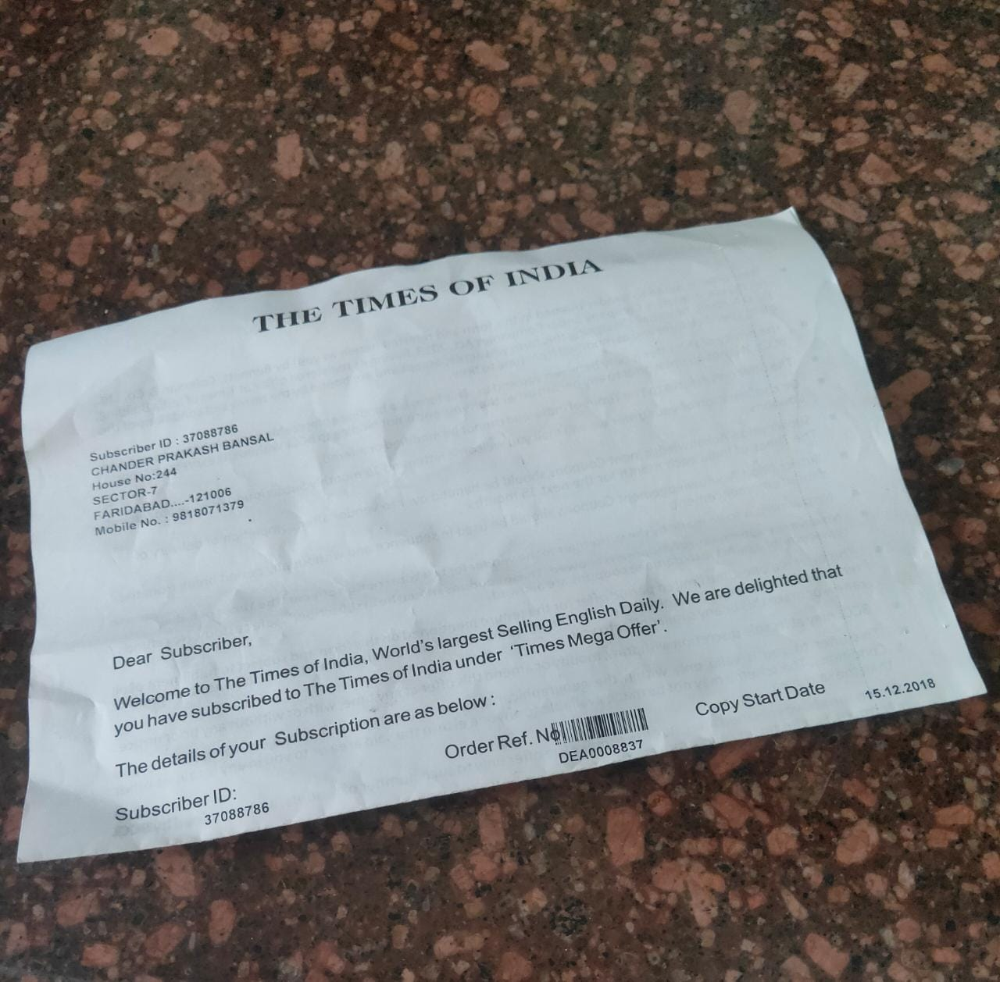
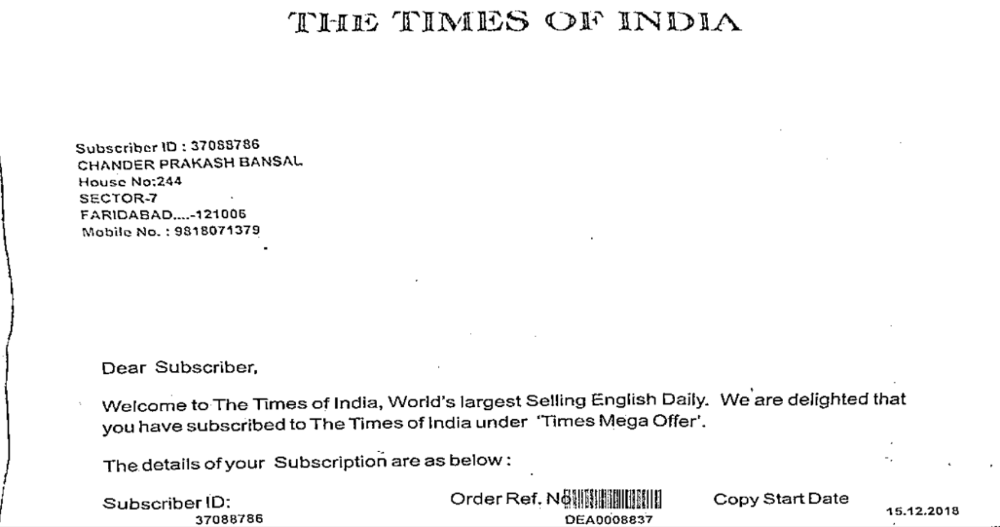

Steps followed:-
1. Converting the image to grayscale
2. Finding the edges and the contours
3. Sorting the contour to find the biggest (In our case the document we want to scan)
4. Applying a perspective tranform to the resultant image
5. Done.

Original Image:-  

Scanned Result:-  

